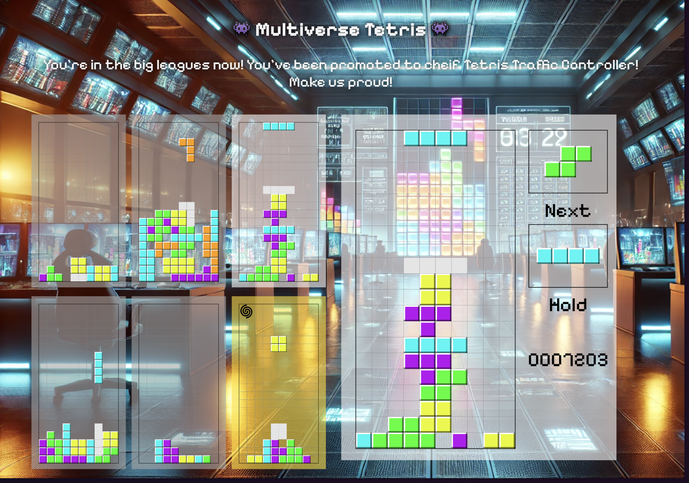

# Multiverse Tetris

Our uOttaHack 7 project!

## 👾 The Game

Welcome to your first day at Tetris Traffic Control! Your job is to manage the traffic of Tetris blocks as they fall from the sky.

But our workplace is embracing automation, and we've got a new fangled AI! So for increased efficiency, you'll be managing up to 6 boards at once as your progress through the story and wrack up a huge score.

The AI might also get stuck sometimes with new pieces it hasn't seen in it's training data, so you'll have to help out!

Can you handle the pressure?

Play the game [here](https://superzooper3.github.io/multiverse-tetris/).

It's all an analogy for modern air traffic control systems where AI and automation play a significant role. Just as in Tetris Traffic Control, air traffic controllers must manage complex situations and make critical decisions while AI handles the routine tasks.

The game is a fun way to explore the challenges of automation and the importance of **human oversight to handle unforeseen** circumstances.

## ⚙️ Features

- Classic Tetris game with a twist! You start with a restricted piece set and discover new pieces as you progress through the story.
- Manage up to 6 boards at once by clicking on them
- AI disturbances as new pieces appear. Help the AI out by clicking on the board and clearing a couple of lines to train it.
- Cheat codes to skip through the story (Shift + [T, Y, U, I])

## 🎮 Inspiration

Think of this game as a mashup of:

- Tower Defense Games
- Mini Metro and other management type games
- Overcooked! and Papa's Pizzeria

## ❤️ Credit

The core tetris engine is forked from [this repository](https://github.com/jonmenard/Tetris) by `jonmenard`.
